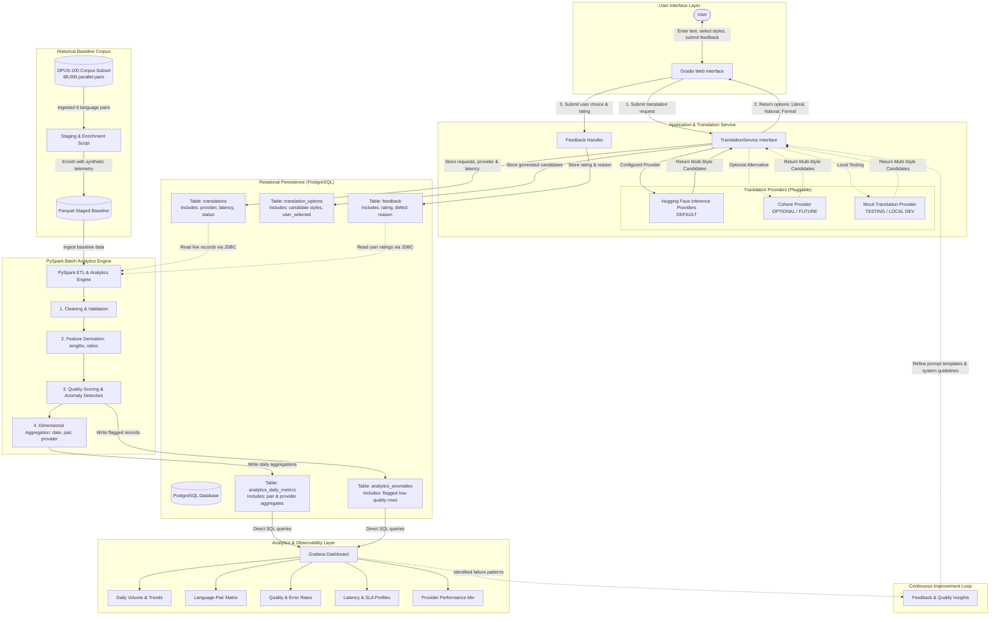

# System Architecture
# Translation Quality Analytics & Continuous Improvement Platform

**Status**: Architectural Specification (Updated for Pluggable Provider Architecture)  
**Version**: 1.1.0  
**Phase**: Architecture & Documentation

---

## 1. High-Level Architecture Diagram



---

## 2. Core Architectural Components

### 2.1 Presentation Layer: Gradio Web UI
- **Role**: Serves as the zero-overhead, highly interactive user frontend.
- **Provider Decoupling**: The Gradio UI interacts exclusively with the internal `TranslationService` API and is completely agnostic of whether Hugging Face, Cohere, or MockProvider is active.
- **Responsibility**:
  - Collects source text input, source language, and target language.
  - Presents translation variants (Literal, Natural / Idiomatic, Formal / Context-aware) with character counts.
  - Captures the user's explicit selection.
  - Provides a streamlined feedback modal (`GOOD` / `POOR`, failure reason taxonomy, optional commentary).
- **Technology**: Gradio (Python 3.10+).

### 2.2 Application & Translation Service Layer
- **`TranslationService`**: The core facade orchestrating the translation lifecycle:
  - Validates and sanitizes input payloads.
  - Resolves the active provider based on environment configuration (`TRANSLATION_PROVIDER`).
  - Measures end-to-end request latency using monotonic clocks.
  - Handles provider errors and returns a normalized `TranslationResponseDTO`.
  - Persists the transaction to the PostgreSQL repository.
- **Provider Implementations** (`src/translation/providers/`):
  - `HuggingFaceTranslationProvider`: **Default provider**. Connects to Hugging Face Inference Providers using `HF_TOKEN`.
  - `MockTranslationProvider`: **Local testing provider**. Fast, deterministic mock generator returning simulated styles for unit testing and offline development.
  - `CohereTranslationProvider`: **Optional / Future provider**. Connects to Cohere API using `COHERE_API_KEY` when enabled.

### 2.3 Relational Persistence Layer (PostgreSQL)
- **Role**: System of record for operational transactions and data marts for Grafana queries.
- **Schema**:
  - `translations`: Tracks the original request, input text, source/target languages, provider tag (`huggingface`, `cohere`, `mock`), latency, and status.
  - `translation_options`: Stores each candidate generated for the request, marking user selection.
  - `feedback`: Stores user qualitative ratings (`GOOD`/`POOR`), reasons, and notes.
  - `analytics_*`: Aggregated analytical tables written by PySpark, indexed for ultra-fast Grafana queries.

### 2.4 Baseline Corpus & Staging (OPUS-100)
- **Role**: Foundational academic parallel corpus providing benchmark scale (68,000 pairs ingested across 6 English-centric pairs).
- **Design Invariant**: OPUS-100 provides strictly source and target text. Operational metadata (latencies, simulated feedback, provider tag) is added during baseline staging into Parquet format.

### 2.5 Big Data Engine (PySpark ETL)
- **Role**: Distributed batch data cleaning, feature engineering, and statistical aggregation.
- **Provider Independence**: Operates on unified data schemas. The `provider` field is treated as an optional analytical grouping dimension rather than altering pipeline behavior.
- **Key Pipeline Stages**:
  1. **Ingestion**: Reads baseline staged Parquet files and PostgreSQL operational records.
  2. **Data Cleaning**: Strips invalid Unicode, deduplicates, and validates language tags.
  3. **Feature Derivation**: Calculates source/target character lengths, word counts, and length ratios ($L_{target} / L_{source}$).
  4. **Quality & Anomaly Engine**: Assigns deterministic quality categories (`EXCELLENT`, `GOOD`, `NEEDS_REVIEW`, `POOR`) and flags potential truncation, runaway generation, or excessive latency.
  5. **Aggregation**: Aggregates metrics along temporal (`day`), language pair (`en-hi`, `en-fr`, etc.), style option, and provider dimensions.
  6. **Egress**: Writes clean aggregated tables back to PostgreSQL via JDBC.

### 2.6 Observability Layer (Grafana)
- **Role**: Real-time visualization for engineering, product, and linguistics teams.
- **Dashboards**:
  - Core Panels: Volume trends, Language-Pair Performance Matrix, Quality Distribution, Feedback Defect Distribution.
  - Secondary Provider Panels: Volume by provider, Average latency by provider, Poor-quality rate by provider.

### 2.7 Continuous Improvement Loop
- **Feedback-Driven Prompt & Configuration Tuning**:
  - Grafana and PySpark isolate linguistic failure clusters (e.g., `TOO_LITERAL` downvotes in `en-hi`).
  - Linguistics engineers analyze flagged anomalies in `analytics_anomalies`.
  - Prompt instructions, system guidelines, and few-shot examples are systematically updated in `src/translation/prompts.py`.
  - Subsequent translations demonstrate measurable quality recovery without risky or unfeasible model fine-tuning.

---

## 3. Strict 3-Tier Data Separation

```
+-----------------------------------------------------------------------------------+
| TIER 1: BASE CORPUS DATA (Directly from OPUS-100)                                 |
| - source_text (string)                                                            |
| - translated_text (string)                                                        |
| - source_language (string ISO-639-1)                                              |
| - target_language (string ISO-639-1)                                              |
+-----------------------------------------------------------------------------------+
                                         |
                                         v (Enriched during staging / live runtime)
+-----------------------------------------------------------------------------------+
| TIER 2: APPLICATION & SERVICE METADATA (Generated by System / Users)              |
| - request_id (UUID)                                                               |
| - provider (string: huggingface, cohere, mock)                                    |
| - translation_time_ms (integer)                                                   |
| - confidence_score (float 0.0 - 1.0)                                              |
| - translation_option_style (enum: LITERAL, NATURAL, FORMAL)                       |
| - user_selected (boolean)                                                         |
| - feedback_rating (enum: GOOD, POOR, NULL)                                        |
| - feedback_reason (enum: INCORRECT_MEANING, GRAMMAR, TOO_LITERAL, etc.)            |
| - created_at (timestamp)                                                          |
+-----------------------------------------------------------------------------------+
                                         |
                                         v (Derived inside PySpark batch jobs)
+-----------------------------------------------------------------------------------+
| TIER 3: DERIVED ANALYTICS FEATURES (Calculated by PySpark)                        |
| - source_char_length (integer)                                                    |
| - translation_char_length (integer)                                               |
| - source_word_count (integer)                                                     |
| - translation_word_count (integer)                                                |
| - length_ratio (float: translation_length / source_length)                        |
| - quality_score (float 0.0 - 100.0)                                               |
| - quality_category (enum: EXCELLENT, GOOD, NEEDS_REVIEW, POOR)                     |
| - performance_category (enum: FAST, NORMAL, SLOW, TIMEOUT)                       |
| - anomaly_flag (boolean)                                                          |
+-----------------------------------------------------------------------------------+
```

---

## 4. Communication Protocols and Boundaries
| Boundary | Mechanism | Payload Format | Resilience Strategy |
| :--- | :--- | :--- | :--- |
| **Gradio $\to$ TranslationService** | In-Process Python Method Call | Typed DTOs (`TranslationRequestDTO`) | In-memory exception handling |
| **TranslationService $\to$ Provider** | Internal Provider Interface (`BaseTranslationProvider`) | Standardized Request DTO | Strategy pattern, pluggable provider |
| **Hugging Face Provider $\to$ HF API** | HTTPS REST / `huggingface_hub` | JSON (Inference Request) | Exponential backoff, jitter, timeout |
| **Cohere Provider $\to$ Cohere API** | HTTPS REST / SDK | JSON (Structured Prompt) | Exponential backoff, retry handler |
| **App Service $\to$ PostgreSQL** | PostgreSQL Wire Protocol (TCP 5432) | Parameterized SQL (SQLAlchemy) | Connection pooling, transaction rollback |
| **PySpark $\to$ PostgreSQL** | JDBC over TCP 5432 | Batched relational inserts | Idempotent upserts / partition overwrite |
| **Grafana $\to$ PostgreSQL** | Native PostgreSQL Datasource | Read-only SQL queries | Pre-aggregated tables, read-only user |
