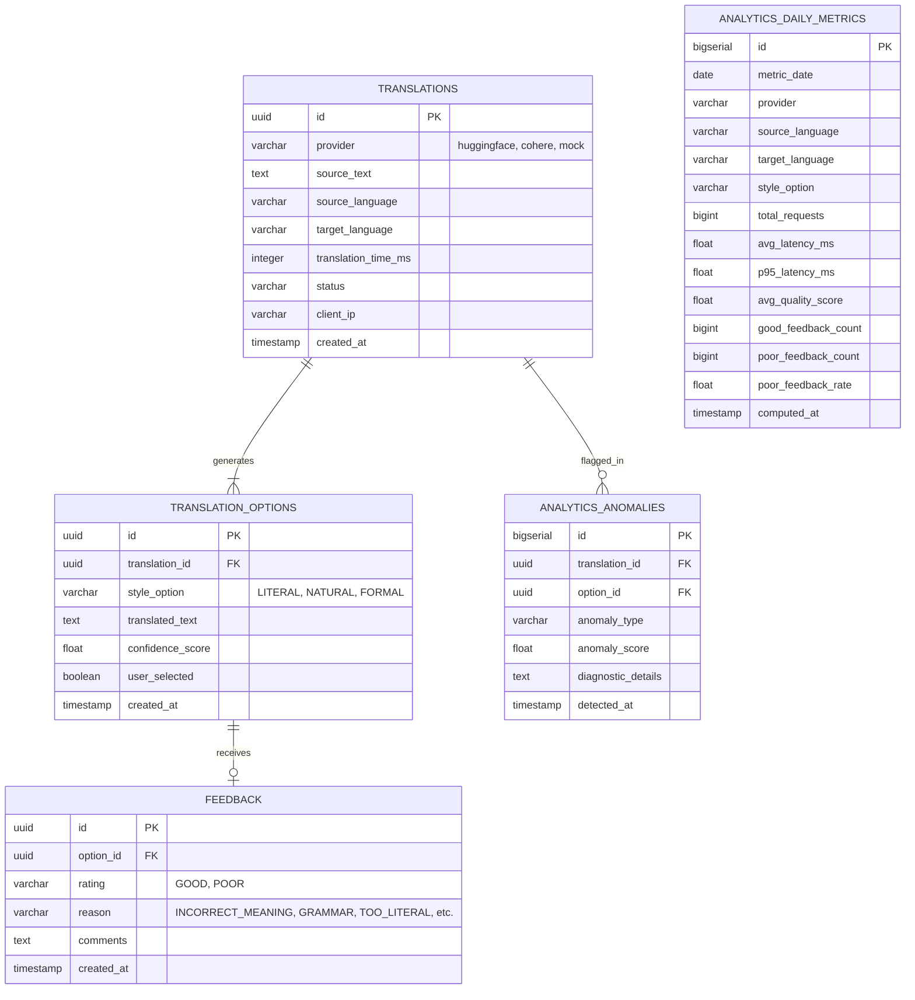

# Database Architecture & Schema Specification
# Translation Quality Analytics & Continuous Improvement Platform

**Status**: Database Schema Specification (Updated with Provider Attribute)  
**Version**: 1.1.0  
**Phase**: Architecture & Documentation

---

## 1. Relational Database Overview
The platform utilizes **PostgreSQL 15+** as its operational system of record and primary data mart for Grafana queries.
The schema is normalized to Third Normal Form (3NF) for transactional operational workflows (`translations`, `translation_options`, `feedback`), while maintaining pre-aggregated summary marts (`analytics_daily_metrics`, `analytics_anomalies`) populated by PySpark for sub-second analytical dashboard responsiveness.

To support multi-provider observability without schema complexity, the `translations` table includes an optional `provider` tag recording which provider generated the translation (`huggingface`, `cohere`, `mock`).

---

## 2. Entity-Relationship (ER) Diagram

---

## 3. Table Definitions & Data Dictionaries

### 3.1 Table: `translations`
- **Purpose**: Stores individual translation requests submitted by users via Gradio or API clients.
- **Constraints & Indexes**:
  - `PK_translations`: `PRIMARY KEY (id)`
  - `IDX_translations_created_at`: B-tree index on `created_at DESC`
  - `IDX_translations_pair`: B-tree composite index on `(source_language, target_language)`
  - `IDX_translations_provider`: B-tree index on `provider`

| Column Name | Data Type | Nullable | Default | Description |
| :--- | :--- | :--- | :--- | :--- |
| `id` | `UUID` | No | `gen_random_uuid()` | Unique request identifier |
| `provider` | `VARCHAR(30)` | No | `'huggingface'` | Active provider: `huggingface`, `cohere`, `mock` |
| `source_text` | `TEXT` | No | - | Source string entered by user |
| `source_language` | `VARCHAR(10)` | No | - | ISO-639-1 code (e.g., `en`) |
| `target_language` | `VARCHAR(10)` | No | - | ISO-639-1 code (e.g., `hi`, `fr`) |
| `translation_time_ms`| `INTEGER` | No | - | Total round-trip latency in ms |
| `status` | `VARCHAR(20)` | No | `'COMPLETED'` | `COMPLETED`, `FAILED`, `TIMEOUT` |
| `client_ip` | `VARCHAR(45)` | Yes | `NULL` | Hashed/masked caller IP address |
| `created_at` | `TIMESTAMPTZ` | No | `CURRENT_TIMESTAMP`| Timestamp of request creation |

---

### 3.2 Table: `translation_options`
- **Purpose**: Holds candidate translation styles returned by the active provider.
- **Constraints & Indexes**:
  - `PK_translation_options`: `PRIMARY KEY (id)`
  - `FK_translation_options_parent`: `FOREIGN KEY (translation_id) REFERENCES translations(id) ON DELETE CASCADE`
  - `IDX_options_translation_id`: B-tree on `translation_id`

| Column Name | Data Type | Nullable | Default | Description |
| :--- | :--- | :--- | :--- | :--- |
| `id` | `UUID` | No | `gen_random_uuid()` | Unique candidate option identifier |
| `translation_id` | `UUID` | No | - | Foreign key to parent `translations` record |
| `style_option` | `VARCHAR(30)` | No | - | Style: `LITERAL`, `NATURAL`, `FORMAL` |
| `translated_text` | `TEXT` | No | - | Generated candidate text |
| `confidence_score` | `REAL` | Yes | `NULL` | Model output or normalized confidence (0.0 to 1.0) |
| `user_selected` | `BOOLEAN` | No | `FALSE` | Indicates whether user picked this variant |
| `created_at` | `TIMESTAMPTZ` | No | `CURRENT_TIMESTAMP`| Candidate generation timestamp |

---

### 3.3 Table: `feedback`
- **Purpose**: Persists qualitative user evaluations of specific generated translation options.
- **Constraints & Indexes**:
  - `PK_feedback`: `PRIMARY KEY (id)`
  - `FK_feedback_option`: `FOREIGN KEY (option_id) REFERENCES translation_options(id) ON DELETE CASCADE`
  - `CK_feedback_rating`: `CHECK (rating IN ('GOOD', 'POOR'))`
  - `CK_feedback_reason`: `CHECK (reason IN ('INCORRECT_MEANING', 'GRAMMAR', 'TOO_LITERAL', 'WRONG_CONTEXT', 'OTHER') OR reason IS NULL)`
  - `IDX_feedback_option_id`: B-tree index on `option_id`
  - `IDX_feedback_created_at`: B-tree index on `created_at DESC`

| Column Name | Data Type | Nullable | Default | Description |
| :--- | :--- | :--- | :--- | :--- |
| `id` | `UUID` | No | `gen_random_uuid()` | Unique feedback record identifier |
| `option_id` | `UUID` | No | - | Foreign key to evaluated `translation_options` |
| `rating` | `VARCHAR(10)` | No | - | User evaluation: `'GOOD'` or `'POOR'` |
| `reason` | `VARCHAR(30)` | Yes | `NULL` | Defect reason if rating is `'POOR'` |
| `comments` | `TEXT` | Yes | `NULL` | Optional qualitative feedback text |
| `created_at` | `TIMESTAMPTZ` | No | `CURRENT_TIMESTAMP`| Feedback submission timestamp |

---

### 3.4 Table: `analytics_daily_metrics`
- **Purpose**: Pre-aggregated reporting data mart generated by PySpark batch jobs for high-performance Grafana queries.
- **Constraints & Indexes**:
  - `PK_daily_metrics`: `PRIMARY KEY (id)`
  - `UQ_daily_metrics_slice`: `UNIQUE (metric_date, provider, source_language, target_language, style_option)`
  - `IDX_daily_metrics_lookup`: Composite B-tree index on `(metric_date, source_language, target_language)`

| Column Name | Data Type | Nullable | Description |
| :--- | :--- | :--- | :--- |
| `id` | `BIGSERIAL` | No | Primary key sequence |
| `metric_date` | `DATE` | No | Partition/aggregation date |
| `provider` | `VARCHAR(30)` | No | Provider: `huggingface`, `cohere`, `mock`, or `opus100_baseline` |
| `source_language` | `VARCHAR(10)` | No | Source language ISO code |
| `target_language` | `VARCHAR(10)` | No | Target language ISO code |
| `style_option` | `VARCHAR(30)` | No | Candidate style (`LITERAL`, `NATURAL`, `FORMAL`) |
| `total_requests` | `BIGINT` | No | Count of translations in this slice |
| `avg_latency_ms` | `REAL` | No | Mean translation latency in milliseconds |
| `p95_latency_ms` | `REAL` | No | 95th percentile translation latency |
| `avg_quality_score`| `REAL` | No | Mean computed heuristic quality score (0–100) |
| `good_feedback_count`| `BIGINT`| No | Count of positive user ratings |
| `poor_feedback_count`| `BIGINT`| No | Count of negative user ratings |
| `poor_feedback_rate` | `REAL` | No | Ratio: $N_{poor} / (N_{good} + N_{poor})$ |
| `computed_at` | `TIMESTAMPTZ` | No | Batch execution completion timestamp |

---

### 3.5 Table: `analytics_anomalies`
- **Purpose**: Stores flagged low-quality, outlier, or truncated translations for engineering audit and continuous prompt improvement.
- **Constraints & Indexes**:
  - `PK_analytics_anomalies`: `PRIMARY KEY (id)`
  - `FK_anomalies_translation`: `FOREIGN KEY (translation_id) REFERENCES translations(id) ON DELETE SET NULL`
  - `IDX_anomalies_detected_at`: B-tree on `detected_at DESC`

| Column Name | Data Type | Nullable | Description |
| :--- | :--- | :--- | :--- |
| `id` | `BIGSERIAL` | No | Primary key sequence |
| `translation_id` | `UUID` | Yes | Reference to source translation record |
| `option_id` | `UUID` | Yes | Reference to specific candidate option |
| `anomaly_type` | `VARCHAR(50)` | No | E.g., `LENGTH_DISCREPANCY`, `LATENCY_SPIKE`, `DOWNVOTE_CLUSTER` |
| `anomaly_score` | `REAL` | No | Normalized severity score (0.0 to 1.0) |
| `diagnostic_details`| `TEXT` | Yes | JSON-encoded diagnostic context |
| `detected_at` | `TIMESTAMPTZ` | No | Spark anomaly detection run timestamp |
