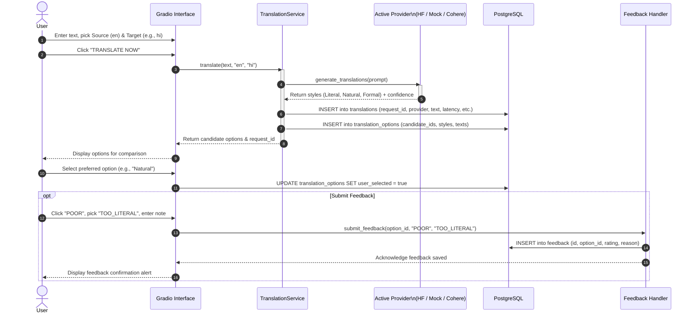
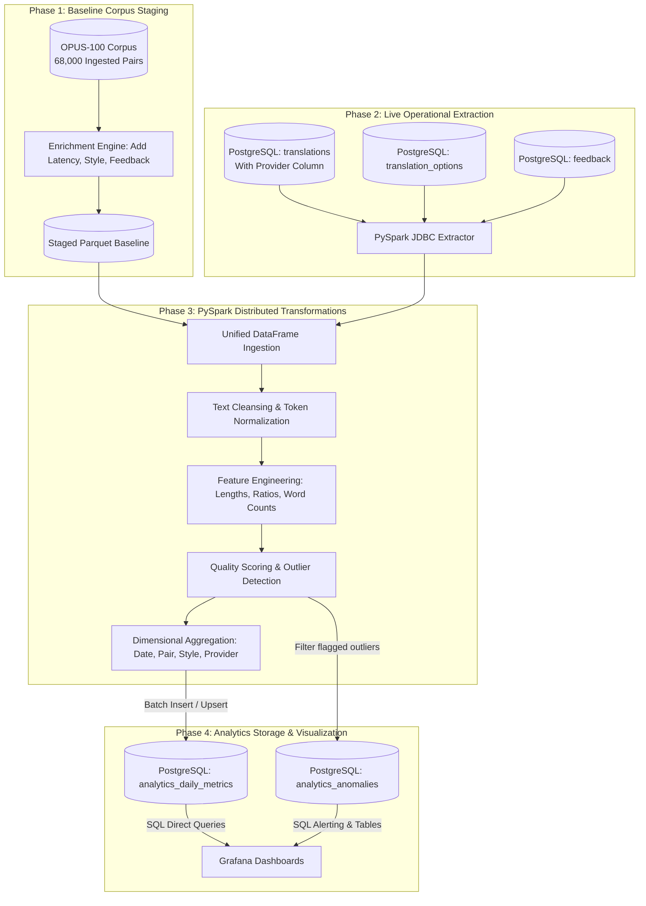

# Data Flow Architecture & Lifecycle
# Translation Quality Analytics & Continuous Improvement Platform

**Status**: Data Flow Specification (Updated for Multi-Provider Architecture)  
**Version**: 1.1.0  
**Phase**: Architecture & Documentation

---

## 1. End-to-End Data Lifecycle Overview

The platform operates across two synchronized data pathways:
1. **Interactive Real-Time Transaction Flow**: Handles live user translation requests, variant selection, and feedback capture via Gradio and `TranslationService` (delegating to Hugging Face, Cohere, or MockProvider) into PostgreSQL.
2. **Batch Big Data Analytics & Staging Flow**: Stages external baseline corpus (OPUS-100), ingests live PostgreSQL data, runs PySpark feature transformations and quality classifications, and writes analytical marts for Grafana.

---

## 2. Interactive Real-Time Data Flow

### 2.1 Live Request & Feedback Sequence

---

## 3. Batch Big Data Analytics Flow

### 3.1 Batch ETL Pipeline Flow

---

## 4. Stage-by-Stage Data Transformation Matrix

| Stage | Input Data | Operation | Output Data | Storage Target |
| :--- | :--- | :--- | :--- | :--- |
| **0. Raw Ingest** | OPUS-100 raw archives | Filter to target pairs (`en-hi`, `en-fr`, `en-es`, `en-de`, `en-bn`, `en-ja`) | Clean parallel text | `data/raw/opus100/` (68k rows) |
| **1. Baseline Staging** | Raw OPUS-100 | Inject realistic operational telemetry (latencies, candidate styles, baseline ratings) with `provider='opus100_baseline'` | Enriched baseline records | `data/interim/enriched_baseline/` (Parquet) |
| **2. Spark Ingest** | Staged Parquet + PostgreSQL tables | Schema unification, timestamp casting | Raw Spark DataFrame | In-memory Spark DataFrame |
| **3. Clean & Validate** | Raw Spark DataFrame | Filter nulls, trim whitespace, deduplicate IDs, validate ISO language codes | Sanitized DataFrame | Spark memory |
| **4. Feature Engineering** | Sanitized DataFrame | Compute `char_len_src`, `char_len_tgt`, `word_cnt_src`, `word_cnt_tgt`, $Ratio = \frac{len(tgt)}{len(src)}$ | Enriched Features DataFrame | Spark memory |
| **5. Quality Scoring** | Enriched Features DataFrame | Calculate weighted $Q$-score, assign quality categories (`EXCELLENT`, `GOOD`, `NEEDS_REVIEW`, `POOR`), flag anomalies | Scored DataFrame | Spark memory |
| **6. Aggregation** | Scored DataFrame | Group by `(metric_date, provider, source_lang, target_lang, style_option)` computing volume, percentiles, downvote rate | Aggregated Metrics DataFrame | Spark memory |
| **7. Egress** | Aggregated & Outlier DataFrames | JDBC write with connection pooling | Relational Analytics Mart | PostgreSQL `analytics_*` |
| **8. Visualization** | PostgreSQL `analytics_*` | Time-series and categorical SQL queries | Interactive charts, alerts | Grafana |
