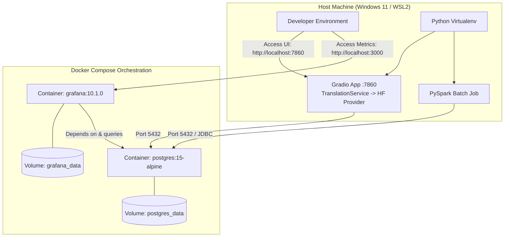

# Containerization & Infrastructure Architecture
# Translation Quality Analytics & Continuous Improvement Platform

**Status**: Infrastructure Specification (Updated for Pluggable Provider Architecture)  
**Version**: 1.1.0  
**Phase**: Architecture & Documentation

---

## 1. Container Strategy & Principles
The platform leverages **Docker** and **Docker Compose** to provide reproducible local infrastructure for persistence and monitoring.

### Key Architectural Invariants:
1. **Scope Boundary**: Containerization is used strictly where it simplifies local dependency management (PostgreSQL and Grafana).
2. **Provider Agnostic**: The infrastructure does not depend on or require any specific commercial LLM provider. Default development uses `TRANSLATION_PROVIDER=huggingface` with `HF_TOKEN`. Cohere credentials are NOT required.
3. **No Hardcoded Tokens**: Neither `HF_TOKEN` nor `COHERE_API_KEY` are baked into Dockerfiles or `docker-compose.yml`. Secrets are passed at runtime through environment variables.
4. **PySpark Execution**: PySpark runs locally within the Python virtual environment to facilitate rapid debugging without multi-container Spark cluster overhead.
5. **No Kubernetes**: Kubernetes is intentionally omitted to avoid unnecessary complexity.

---

## 2. Service Definitions & Topology



---

## 3. Docker Compose Service Specifications

### 3.1 Service: `postgres`
- **Image**: `postgres:15-alpine`
- **Host Port**: `5432:5432`
- **Volume**: `postgres_data:/var/lib/postgresql/data`
- **Init Script Mount**: `./src/database/init_schema.sql:/docker-entrypoint-initdb.d/init_schema.sql:ro`
- **Environment Variables**:
  - `POSTGRES_USER`: `${POSTGRES_USER:-postgres}`
  - `POSTGRES_PASSWORD`: `${POSTGRES_PASSWORD:-postgres}`
  - `POSTGRES_DB`: `${POSTGRES_DB:-translation_analytics}`
- **Healthcheck**:
  ```yaml
  test: ["CMD-SHELL", "pg_isready -U ${POSTGRES_USER:-postgres} -d ${POSTGRES_DB:-translation_analytics}"]
  interval: 5s
  timeout: 5s
  retries: 5
  ```

### 3.2 Service: `grafana`
- **Image**: `grafana/grafana:10.1.0`
- **Host Port**: `3000:3000`
- **Volume**: `grafana_data:/var/lib/grafana`
- **Provisioning Mounts**:
  - `./grafana/provisioning/datasources:/etc/grafana/provisioning/datasources:ro`
  - `./grafana/provisioning/dashboards:/etc/grafana/provisioning/dashboards:ro`
- **Environment Variables**:
  - `GF_SECURITY_ADMIN_USER`: `${GRAFANA_ADMIN_USER:-admin}`
  - `GF_SECURITY_ADMIN_PASSWORD`: `${GRAFANA_ADMIN_PASSWORD:-admin}`
  - `GF_USERS_ALLOW_SIGN_UP`: `false`
- **Dependencies**:
  - `postgres`: Condition `service_healthy`

---

## 4. Lifecycle Commands
- **Launch Supporting Infrastructure**:
  ```bash
  docker compose up -d postgres grafana
  ```
- **Verify Running Containers**:
  ```bash
  docker compose ps
  ```
- **Teardown**:
  ```bash
  docker compose down
  ```
