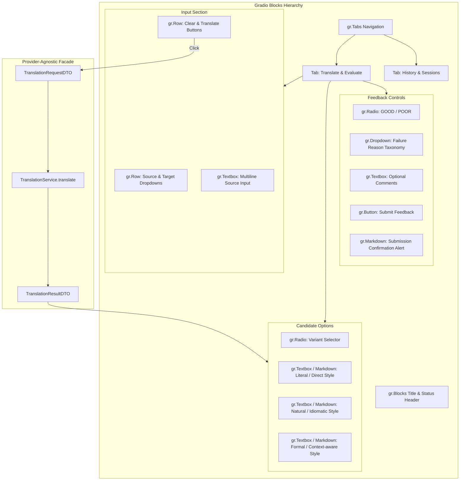

# Gradio User Interface Specification
# Translation Quality Analytics & Continuous Improvement Platform

**Status**: UI Design Specification (Updated for Pluggable Provider Architecture)  
**Version**: 1.1.0  
**Phase**: Architecture & Documentation

---

## 1. Interface Overview & Philosophy
The user interface is powered exclusively by **Gradio** (`gradio_app/app.py`). 

> **ARCHITECTURAL MANDATE:**  
> The Gradio UI contains ZERO provider-specific code. 
> The UI exclusively calls `TranslationService.translate(...)` and remains completely agnostic of whether the backend is powered by Hugging Face Inference Providers, Cohere, or MockProvider.
> No React, Next.js, or Vite frontend frameworks will be used.

---

## 2. Layout & Wireframe Blueprint

```
+--------------------------------------------------------------------------------------------------+
|                   Translation Quality Analytics & Continuous Improvement Platform                |
|       [ Operational Status: Active ]   [ Provider: Hugging Face (Default) ]   [ DB: Connected ]  |
+--------------------------------------------------------------------------------------------------+
| [TAB 1: Translate & Evaluate]                          | [TAB 2: Session Translation History]    |
+--------------------------------------------------------+-----------------------------------------+
|                                                                                                  |
|  Source Language: [ English (en)             v ]    Target Language: [ Hindi (hi)          v ]   |
|                                                                                                  |
|  Input Source Text:                                                                              |
|  +--------------------------------------------------------------------------------------------+  |
|  | The sudden change in economic policy created widespread uncertainty among small businesses.|  |
|  +--------------------------------------------------------------------------------------------+  |
|  Characters: 89 / 5,000                                           [ Clear ]  [ TRANSLATE NOW ]   |
|                                                                                                  |
|--------------------------------------------------------------------------------------------------|
|  Generated Translation Options:                                                                  |
|                                                                                                  |
|  ( * ) Option A: NATURAL / IDIOMATIC [PREFERRED]                                                 |
|  +--------------------------------------------------------------------------------------------+  |
|  | आर्थिक नीति में अचानक हुए बदलाव ने छोटे व्यवसायों में भारी अनिश्चितता पैदा कर दी।         |  |
|  +--------------------------------------------------------------------------------------------+  |
|  Latency: 1,120 ms | Est. Confidence: 94%                                                        |
|                                                                                                  |
|  (   ) Option B: FORMAL / CONTEXT-AWARE                                                          |
|  +--------------------------------------------------------------------------------------------+  |
|  | आर्थिक नीति में अचानक परिवर्तन के कारण लघु उद्यमों के मध्य व्यापक अनिश्चितता उत्पन्न हुई।     |  |
|  +--------------------------------------------------------------------------------------------+  |
|                                                                                                  |
|  (   ) Option C: LITERAL / DIRECT                                                                |
|  +--------------------------------------------------------------------------------------------+  |
|  | अचानक परिवर्तन आर्थिक नीति में बनाया व्यापक अनिश्चितता छोटे व्यवसायों के बीच।              |  |
|  +--------------------------------------------------------------------------------------------+  |
|                                                                                                  |
|--------------------------------------------------------------------------------------------------|
|  Provide Translation Quality Feedback:                                                          |
|                                                                                                  |
|  Evaluation: [ (Thumbs Up) GOOD ]   [ (Thumbs Down) POOR ]                                       |
|                                                                                                  |
|  If Poor, Primary Reason: [ TOO_LITERAL                                                      v ] |
|  Taxonomy: INCORRECT_MEANING | GRAMMAR | TOO_LITERAL | WRONG_CONTEXT | OTHER                     |
|                                                                                                  |
|  Comments / Corrections (Optional):                                                              |
|  +--------------------------------------------------------------------------------------------+  |
|  | The literal option breaks word order completely. Natural version is very clear.             |  |
|  +--------------------------------------------------------------------------------------------+  |
|                                                                     [ SUBMIT QUALITY FEEDBACK ]  |
+--------------------------------------------------------------------------------------------------+
```

---

## 3. UI Component Hierarchy & Provider-Agnostic Wiring



---

## 4. State Management & Event Handlers
- **`on_click(translate_fn)`**:
  - Validates that source text is between 1 and 5,000 characters.
  - Displays progress indicator.
  - Calls `TranslationService.translate(...)`.
  - Renders Literal, Natural, and Formal candidate boxes regardless of backend provider.
  - Saves `request_id` and option UUIDs to `gr.State`.
- **`on_change(variant_radio)`**:
  - Marks the user's selected translation option.
  - Asynchronously updates `translation_options.user_selected = TRUE`.
- **`on_change(rating_radio)`**:
  - Shows `feedback_reason` dropdown only when user clicks `POOR`.
- **`on_click(submit_feedback_btn)`**:
  - Invokes `FeedbackService.record_feedback(...)`.
  - Renders success confirmation alert.
